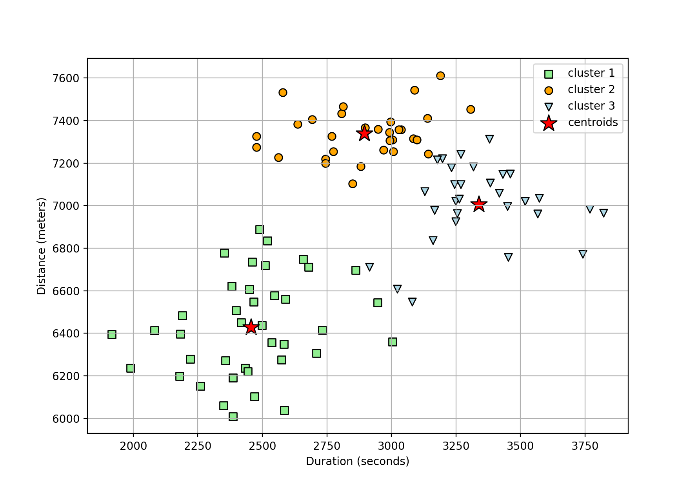

# PRE-REQUISITES
1. An installation of python is required on your machine. 
2. With python installed, install the required packages in requirements file using:
```
    pip3 install -r requirements.txt 
```
## TASK 1
### RUN SERVICE LOCALLY 
Start the service by running in a terminal:
```
    python3 connected_components.py 
```
### TEST
Once the service has started, run a POST request in the terminal or using an API test tool like Postman. An example request is:
```
    curl -i -H "Content-Type: application/json" -X POST -d '{"1":["2","3"],"2":["1","3"],"3":["1","2","4"],"4":["3"],"5":[],"6":["7"],"7":["6"]}' http://localhost:5000/connected_components
```

## TASK 2
The script for the second solution is `estimate_run_stats.py`, which expects to a csv file for the data for be passed in at run time:
```
    python3 estimate_run_stats.py running_observations.csv
```
A scatter plot (similar to the diagram below) showing the cluster points of the 3 routes is expected.
 Figure 1: Example of expected plots. It shows how the points in the running observation fit into the 3 potential routes known.

Question 2: Do I tend to run on each route about as often, or do I have a favorite route?

Answer 2: The number of times each route is ran is about: `30`,`31`, and `39`. This means that you run two routes about as often, but one route a little bit more (about 0.09% more).